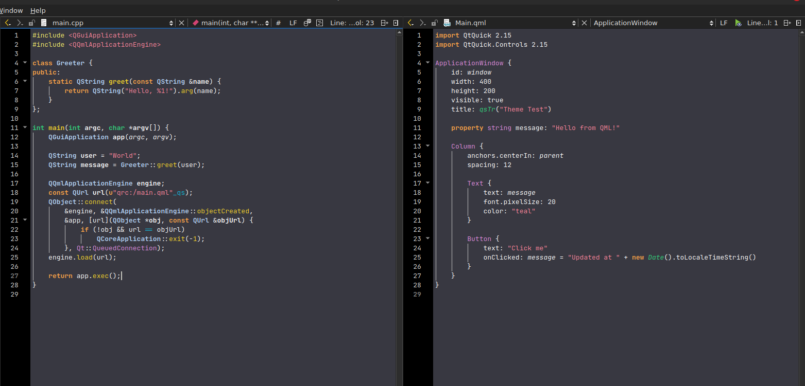

# QtCreator Themes

A collection of custom QtCreator themes I made for myself.

Most themes I found online were a bit too dark for my taste, so I created my own. These are not perfect, colors are mostly tuned for the QtCreator features I actually use. Consider them a work in progress; I’ll probably keep tweaking them, since I’m never fully satisfied (that’s what she said).

Feel free to adjust them to your needs.
And hey — if you like them, drop me a message! I'd love to hear from you.

## Installation

To use these themes in QtCreator on **Linux**:

1. Copy the `.xml` files from this repository into the following directory:

   ```bash
   ~/.config/QtProject/qtcreator/styles
   ```

2. Open QtCreator.

3. Go to **Tools > Options > Environment > Interface**.

4. Under **Color theme**, select your preferred theme from the list.

> 💡 If the `styles` folder doesn't exist, you can create it manually.

---

## Themes

### RetroRain

Quiet colors to try to keep the madness away



